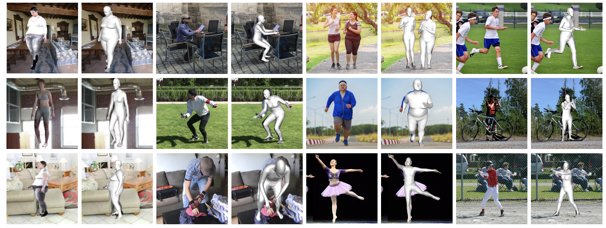
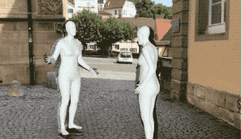
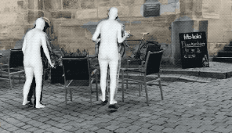
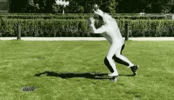
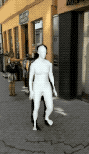
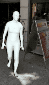
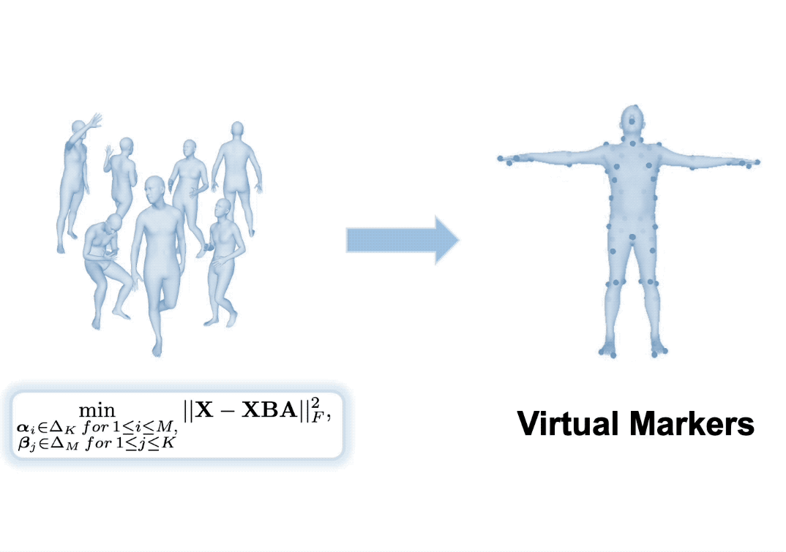
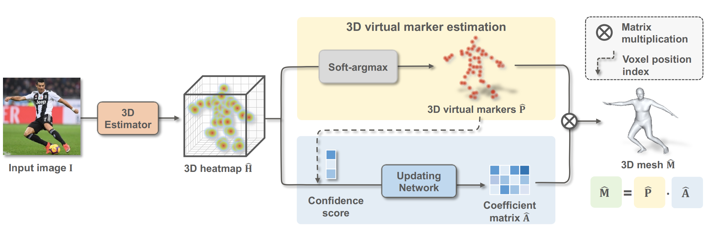

<div align="center">

  <h1 align="center">3D Human Mesh Estimation from Virtual Markers <br> (CVPR 2023)</h1>
  
</div>

<div align="left">

  <a></a>
  <a href="https://pytorch.org/get-started/locally/"></a>
  <a href="https://github.com/ShirleyMaxx/VirtualMarker/blob/main/LICENSE">![License](https://img.shields.io/github/license/metaopt/torchopt?label=license&logo=data:image/svg+xml;base64,PHN2ZyB4bWxucz0iaHR0cDovL3d3dy53My5vcmcvMjAwMC9zdmciIHZpZXdCb3g9IjAgMCAyNCAyNCIgd2lkdGg9IjI0IiBoZWlnaHQ9IjI0IiBmaWxsPSIjZmZmZmZmIj48cGF0aCBmaWxsLXJ1bGU9ImV2ZW5vZGQiIGQ9Ik0xMi43NSAyLjc1YS43NS43NSAwIDAwLTEuNSAwVjQuNUg5LjI3NmExLjc1IDEuNzUgMCAwMC0uOTg1LjMwM0w2LjU5NiA1Ljk1N0EuMjUuMjUgMCAwMTYuNDU1IDZIMi4zNTNhLjc1Ljc1IDAgMTAwIDEuNUgzLjkzTC41NjMgMTUuMThhLjc2Mi43NjIgMCAwMC4yMS44OGMuMDguMDY0LjE2MS4xMjUuMzA5LjIyMS4xODYuMTIxLjQ1Mi4yNzguNzkyLjQzMy42OC4zMTEgMS42NjIuNjIgMi44NzYuNjJhNi45MTkgNi45MTkgMCAwMDIuODc2LS42MmMuMzQtLjE1NS42MDYtLjMxMi43OTItLjQzMy4xNS0uMDk3LjIzLS4xNTguMzEtLjIyM2EuNzUuNzUgMCAwMC4yMDktLjg3OEw1LjU2OSA3LjVoLjg4NmMuMzUxIDAgLjY5NC0uMTA2Ljk4NC0uMzAzbDEuNjk2LTEuMTU0QS4yNS4yNSAwIDAxOS4yNzUgNmgxLjk3NXYxNC41SDYuNzYzYS43NS43NSAwIDAwMCAxLjVoMTAuNDc0YS43NS43NSAwIDAwMC0xLjVIMTIuNzVWNmgxLjk3NGMuMDUgMCAuMS4wMTUuMTQuMDQzbDEuNjk3IDEuMTU0Yy4yOS4xOTcuNjMzLjMwMy45ODQuMzAzaC44ODZsLTMuMzY4IDcuNjhhLjc1Ljc1IDAgMDAuMjMuODk2Yy4wMTIuMDA5IDAgMCAuMDAyIDBhMy4xNTQgMy4xNTQgMCAwMC4zMS4yMDZjLjE4NS4xMTIuNDUuMjU2Ljc5LjRhNy4zNDMgNy4zNDMgMCAwMDIuODU1LjU2OCA3LjM0MyA3LjM0MyAwIDAwMi44NTYtLjU2OWMuMzM4LS4xNDMuNjA0LS4yODcuNzktLjM5OWEzLjUgMy41IDAgMDAuMzEtLjIwNi43NS43NSAwIDAwLjIzLS44OTZMMjAuMDcgNy41aDEuNTc4YS43NS43NSAwIDAwMC0xLjVoLTQuMTAyYS4yNS4yNSAwIDAxLS4xNC0uMDQzbC0xLjY5Ny0xLjE1NGExLjc1IDEuNzUgMCAwMC0uOTg0LS4zMDNIMTIuNzVWMi43NXpNMi4xOTMgMTUuMTk4YTUuNDE4IDUuNDE4IDAgMDAyLjU1Ny42MzUgNS40MTggNS40MTggMCAwMDIuNTU3LS42MzVMNC43NSA5LjM2OGwtMi41NTcgNS44M3ptMTQuNTEtLjAyNGMuMDgyLjA0LjE3NC4wODMuMjc1LjEyNi41My4yMjMgMS4zMDUuNDUgMi4yNzIuNDVhNS44NDYgNS44NDYgMCAwMDIuNTQ3LS41NzZMMTkuMjUgOS4zNjdsLTIuNTQ3IDUuODA3eiI+PC9wYXRoPjwvc3ZnPgo=)</a>
  [](https://arxiv.org/pdf/2303.11726.pdf)
  [](https://paperswithcode.com/sota/3d-human-pose-estimation-on-3dpw?p=3d-human-mesh-estimation-from-virtual-markers-1)

</div>


<p align="center">
  
</p>
<p align="middle">
   
   
   
   
   
</p>

## Introduction

This is the offical [Pytorch](https://pytorch.org/) implementation of our paper:
<h3 align="center">3D Human Mesh Estimation from Virtual Markers (CVPR 2023)</h3>

<h4 align="center" style="text-decoration: none;">
  <a href="https://shirleymaxx.github.io/", target="_blank"><b>Xiaoxuan Ma</b></a>
  ,
  <a href="https://scholar.google.com/citations?user=DoUvUz4AAAAJ&hl=en", target="_blank"><b>Jiajun Su</b></a>
  ,
  <a href="https://www.chunyuwang.org/", target="_blank"><b>Chunyu Wang</b></a>
  ,
  <a href="https://wentao.live/", target="_blank"><b>Wentao Zhu</b></a>
  ,
  <a href="https://cfcs.pku.edu.cn/english/people/faculty/yizhouwang/index.htm", target="_blank"><b>Yizhou Wang</b></a>

</h4>
<h4 align="center">
  <a href="https://arxiv.org/pdf/2303.11726.pdf", target="_blank">[arXiv]</a>
</h4>

Below is the learned virtual markers and the overall framework.

<p align="center">
  
   
</p>

## News :triangular_flag_on_post:
[2023/04/23] Demo code released!

## TODO :white_check_mark:

- [x] Provide inference code, support image/video input
- [ ] Provide virtual marker optimization code

## Installation

1. Install dependences. This project is developed using >= python 3.8 on Ubuntu 16.04. NVIDIA GPUs are needed. We recommend you to use an [Anaconda](https://www.anaconda.com/) virtual environment.

  ```bash
    # 1. Create a conda virtual environment.
    conda create -n pytorch python=3.8 -y
    conda activate pytorch

    # 2. Install PyTorch >= v1.6.0 following [official instruction](https://pytorch.org/). Please adapt the cuda version to yours.
    pip install torch==1.7.1+cu101 torchvision==0.8.2+cu101 torchaudio==0.7.2 -f https://download.pytorch.org/whl/torch_stable.html

    # 3. Install other packages. This project doesn't have any special or difficult-to-install dependencies.
    sh requirements.sh

    # 4. Pull our code.
    git clone https://github.com/ShirleyMaxx/VirtualMarker.git
    cd VirtualMarker

    #5. Install Virtual Marker
    python setup.py develop
  ```
2. Prepare SMPL layer. We use [smplx](https://github.com/vchoutas/smplx#installation).

   1. Install `smplx` package by `pip install smplx`. Already done in the first step.
   2. Download `basicModel_f_lbs_10_207_0_v1.0.0.pkl`, `basicModel_m_lbs_10_207_0_v1.0.0.pkl`, and `basicModel_neutral_lbs_10_207_0_v1.0.0.pkl` from [here](https://smpl.is.tue.mpg.de/) (female & male) and [here](http://smplify.is.tue.mpg.de/) (neutral) to `${Project}/data/smpl`. Please rename them as `SMPL_FEMALE.pkl`, `SMPL_MALE.pkl`, and `SMPL_NEUTRAL.pkl`, respectively.
   3. Download others SMPL-related from [Google drive](https://drive.google.com/drive/folders/1LRMo_7raQuSRuUKAvXKSlzlvQJ5C0IHR?usp=share_link) or [Onedrive](https://chinapku-my.sharepoint.com/:f:/g/personal/2101111546_pku_edu_cn/EitToj4t0BlMmKAo6CZT2H8BMmkyAKQBjY6kO5h0htKveA?e=b57zU5) and put them to `${Project}/data/smpl`.
3. Download data following the **Data** section. In summary, your directory tree should be like this

  ```
    ${Project}
    ├── assets
    ├── command
    ├── configs
    ├── data 
    ├── demo 
    ├── experiment 
    ├── inputs 
    ├── lib 
    ├── main 
    ├── models 
    ├── README.md
    ├── setup.py
    `── requirements.sh
  ```

  - `assets` contains the body virtual markers in `npz` format. Feel free to use them.
  - `command` contains the running scripts.
  - `configs` contains the configurations in `yml` format.
  - `data` contains soft links to images and annotations directories.
  - `lib` contains kernel codes for our method.
  - `main` contains high-level codes for training or testing the network.
  - `models` contains pre-trained weights. Download from [Google drive](https://drive.google.com/drive/folders/1IQ-rvjj_t6ZInlzDfKBNeJ0noOs3fIaW?usp=share_link) or [Onedrive](https://chinapku-my.sharepoint.com/:f:/g/personal/2101111546_pku_edu_cn/EggzlMbPMwtDr8aBb8HNySQBuhh3CtWceRbQMcMdiztDcg?e=YgTfry).
  - *`experiment` will be automatically made after running the code, it contains the outputs, including trained model weights, test metrics and visualized outputs.

## Quick demo :star:

1. **Installation.** Make sure you have finished the above installation successfully. VirtualMarker does not detect person and only estimates relative pose and mesh, therefore please also install [VirtualPose](https://github.com/wkom/VirtualPose) following its instructions. VirtualPose will detect all the person and estimate their root depths. Download its model weight from [Google drive](https://drive.google.com/drive/folders/1Y8unp_CQnXsWr1WljAgW0rYCMGkru6Ce?usp=share_link) or [Onedrive](https://chinapku-my.sharepoint.com/:f:/g/personal/2101111546_pku_edu_cn/ElPhUt3LaJpMgv7dH7YbJ2gBHPqS7E6fQg41tszqmHbzmg?e=wyZOKW) and put it under `VirtualPose`.
  ```bash
  git clone https://github.com/wkom/VirtualPose.git
  cd VirtualPose
  python setup.py develop
  ```

2. **Render Env.** If you run this code in ssh environment without display device, please do follow:
  ```
  1. Install osmesa follow https://pyrender.readthedocs.io/en/latest/install/
  2. Reinstall the specific pyopengl fork: https://github.com/mmatl/pyopengl
  3. Set opengl's backend to osmesa via os.environ["PYOPENGL_PLATFORM"] = "osmesa"
  ```

3. **Model weight.** Download the pre-trained VirtualMarker models `baseline_mix` from [Google drive](https://drive.google.com/drive/folders/1ze5fdLC7NSq0GQBi2N8nfp2RNU9RigPl?usp=share_link) or [Onedrive](https://chinapku-my.sharepoint.com/:f:/g/personal/2101111546_pku_edu_cn/EvdcQ8qbV9dMgEV-0iCwrN0BF6ZP3Cg3jaux5BqZxavg8Q?e=F51UNE). Put the weight below `experiment` folder and follow the directory structure. Specify the load weight path by `test.weight_path` in `configs/simple3dmesh_infer/baseline.yml`.

4. **Input image/video.** Prepare `input.jpg` or `input.mp4` and put it at `inputs` folder. Both image and video input are supported. Specify the input path and type by arguments.

5. **RUN.** You can check the output at `experiment/simple3dmesh_infer/exp_*/vis`.
  ```bash
  sh command/simple3dmesh_infer/baseline.sh
  ```
  

## Train & Eval

### Data

The `data` directory structure should follow the below hierarchy. Please download the images from the official sites. Download all the processed annotation files from [Google drive](https://drive.google.com/drive/folders/1rO281oqAmM_r4jJ-y3R1OdxB39rxLwBO?usp=share_link) or [Onedrive](https://chinapku-my.sharepoint.com/:f:/g/personal/2101111546_pku_edu_cn/EhZc4AXYoyNBpVGEzikENb0BQr3TvYdlnKOg-I2CLs7jrw?e=zYbAn5).

```
${Project}
|-- data
    |-- 3DHP
    |   |-- annotations
    |   `-- images
    |-- COCO
    |   |-- annotations
    |   `-- images
    |-- Human36M
    |   |-- annotations
    |   `-- images
    |-- PW3D
    |   |-- annotations
    |   `-- images
    |-- SURREAL
    |   |-- annotations
    |   `-- images
    |-- Up_3D
    |   |-- annotations
    |   `-- images
    `-- smpl
        |-- smpl_indices.pkl
        |-- SMPL_FEMALE.pkl
        |-- SMPL_MALE.pkl
        |-- SMPL_NEUTRAL.pkl
        |-- mesh_downsampling.npz
        |-- J_regressor_extra.npy
        `-- J_regressor_h36m_correct.npy
```

### Train

Every experiment is defined by `config` files. Configs of the experiments in the paper can be found in the `./configs` directory. You can use the scripts under `command` to run.

To train the model, simply run the script below. Specific configurations can be modified in the corresponding `configs/simple3dmesh_train/baseline.yml` file. Default setting is using 4 GPUs (16G V100). Multi-GPU training is implemented with PyTorch's [DataParallel](https://pytorch.org/docs/stable/generated/torch.nn.DataParallel.html#torch.nn.DataParallel). Results can be seen in `experiment` directory or in the tensorboard.

We conduct mix-training on H3.6M and 3DPW datasets. To get the reported results on 3DPW dataset, please first run `train_h36m.sh` and then load the final weight to train on 3DPW by running `train_pw3d.sh`. This finetuning strategy is for faster training and better performance. We train a seperate model on SURREAL dataset using `train_surreal.sh`. 

```bash
sh command/simple3dmesh_train/train_h36m.sh
sh command/simple3dmesh_train/train_pw3d.sh
sh command/simple3dmesh_train/train_surreal.sh
```

### Evaluation

To evaluate the model, specify the model path `test.weight_path` in `configs/simple3dmesh_test/baseline_*.yml`. Argument `--mode test` should be set. Results can be seen in `experiment` directory or in the tensorboard.

```bash
sh command/simple3dmesh_test/test_h36m.sh
sh command/simple3dmesh_test/test_pw3d.sh
sh command/simple3dmesh_test/test_surreal.sh
```

### Model Zoo

| Test set | MPVE |     MPJPE     | PA-MPJPE |  Model weight | Config |  
|----------|----------|------------|------------|-------|-----------|
| Human3.6M    | 58.0 | 47.3 | 32.0 | [Google drive](https://drive.google.com/drive/folders/1QS8efRtC_JjdYFfNuU8rIZGo-Uhe9-ds?usp=share_link) / [Onedrive](https://chinapku-my.sharepoint.com/:f:/g/personal/2101111546_pku_edu_cn/EineK0RVcTJDp3GaHSCmcBcBL5vDIfU2rJTGqwqvvTmerg?e=1yz86L) | [cfg](./configs/simple3dmesh_train/baseline_h36m.yml)    |
| 3DPW         | 77.9 | 67.5 | 41.3 | [Google drive](https://drive.google.com/drive/folders/1tTJ_NbgvQW54XndrOyhUKjBbtKERA9VK?usp=share_link) / [Onedrive](https://chinapku-my.sharepoint.com/:f:/g/personal/2101111546_pku_edu_cn/EhMAavEedCVDsDwqaDVLVQoBV9tr4fuo8BBqBaAlRBCN2Q?e=qtqfGn) | [cfg](./configs/simple3dmesh_train/baseline_pw3d.yml)    |
| SURREAL      | 44.7 | 36.9 | 28.9 | [Google drive](https://drive.google.com/drive/folders/1M_Y0HBMRGNb3ehYVRI3Vr7DzIiPHw96I?usp=share_link) / [Onedrive](https://chinapku-my.sharepoint.com/:f:/g/personal/2101111546_pku_edu_cn/EgLwX0KNRQ1Di8WZdEgEhsABsrkDP4Req24i9nnxAevZuw?e=q1GetL) | [cfg](./configs/simple3dmesh_train/baseline_surreal.yml)    |
| in-the-wild* | | | | [Google drive](https://drive.google.com/drive/folders/1Hlx45hGeYjByUI0gGCfGcUp_afp3FmeO?usp=share_link) / [Onedrive](https://chinapku-my.sharepoint.com/:f:/g/personal/2101111546_pku_edu_cn/EhOEMCI1DVlCkluAHvt8nJEB3f3yDbcYuFJ2YqmFJqvdrg?e=LBQkYH) |  |

\* We further train a model for better inference performance on in-the-wild scenes by finetuning the 3DPW model on SURREAL dataset. 


## Citation
Cite as below if you find this repository is helpful to your project:
```bibtex
@article{ma20233d,
  title={3D Human Mesh Estimation from Virtual Markers},
  author={Ma, Xiaoxuan and Su, Jiajun and Wang, Chunyu and Zhu, Wentao and Wang, Yizhou},
  journal={arXiv preprint arXiv:2303.11726},
  year={2023}
}
```


## Acknowledgement
This repo is built on the excellent work [GraphCMR](https://github.com/nkolot/GraphCMR), [SPIN](https://github.com/nkolot/SPIN), [Pose2Mesh](https://github.com/hongsukchoi/Pose2Mesh_RELEASE), [HybrIK](https://github.com/Jeff-sjtu/HybrIK) and [CLIFF](https://github.com/haofanwang/CLIFF). Thanks for these great projects.